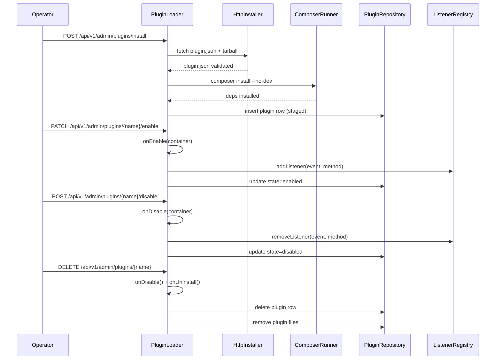

# Plugin SDK — internals reference

This document is for **phlix-server contributors** who want to extend
the plugin loader itself, add a new plugin slot to a host subsystem,
or document new container bindings that plugin authors can resolve.

If you are writing a plugin (not extending the host), the document
you want is [`docs/plugins/developer-guide.md`](../plugins/developer-guide.md).

The contracts described here are stable enough to be relied on by
plugin authors. Step B.1 hoists the most important ones
(`LifecycleInterface`, `ManifestType`, the manifest value object) into
a separate `phlix-shared` package so plugins can depend on the
contracts without dragging in the whole server — see
[§4](#4-phlix-shared-namespace-migration-plan).

---

## TL;DR

This page is the **server-internals reference** for plugin SDK authors and phlix-server contributors extending the plugin loader. It covers the manifest schema, lifecycle walkthrough, container bindings, PSR-14 events, how to add a new plugin type, the `phlix-shared` migration, and loader extension points.

If you are **writing a plugin**, start with [`docs/plugins/developer-guide.md`](../plugins/developer-guide.md) instead. That guide is the author-facing getting-started view; this doc explains how the host implements it.

**What N.26 added:** complete `plugin.json` manifest field table, numbered lifecycle walkthrough (install → enable → disable → uninstall), PSR-14 hook reference table, end-to-end sample plugin walkthrough with code, and three canonical failure scenarios with fixes.

---

## 1. Container bindings plugins can resolve

`PluginLoader::enable()` instantiates the plugin's entry class through
`Psr\Container\ContainerInterface::get()`, and passes the same
container to `onEnable()`. That means every binding the host
container exposes is fair game for a plugin to type-hint in its
constructor (PHP-DI will autowire them) or to ask for inside
`onEnable()`.

The bindings below are **stable** — they ship as part of the host
container today and are intended for plugin use. Internal-only
bindings (provider classes, factories, schema loaders) are deliberately
excluded.

### Logging

| Container ID                                | Type                                         | Purpose                                                |
| ------------------------------------------- | -------------------------------------------- | ------------------------------------------------------ |
| `Psr\Log\LoggerInterface`                   | Default Monolog channel                      | Generic logging when you don't care about the channel  |
| `Phlix\Common\Logger\LoggerFactory`         | Factory                                      | Resolve `LoggerFactory::get(LogChannels::PLUGINS)` etc.|
| `logger.plugins`                            | `Phlix\Common\Logger\StructuredLogger`       | Plugins channel — recommended for plugin output        |
| `logger.auth`, `logger.http`, `logger.media`, `logger.session`, `logger.streaming`, `logger.websocket`, `logger.events` | `StructuredLogger` | Named loggers per `LogChannels` constant               |
| `Phlix\Common\Logger\AuditLogger`           | `AuditLogger`                                | Security-event audit trail                             |

Convention: use `logger.plugins` from plugin code so the operator can
filter your output with the `--channel=plugins` log-cat dial.

### Database

| Container ID                       | Type                              | Notes                                       |
| ---------------------------------- | --------------------------------- | ------------------------------------------- |
| `Workerman\MySQL\Connection`       | `Workerman\MySQL\Connection`      | Parameterized queries only (see CLAUDE.md). |

Plugins must use parameterized queries. Never interpolate plugin
input into SQL strings — `$db->query('... ?', [$value])` is the only
sanctioned shape.

### Events (PSR-14)

| Container ID                                       | Type                                            | Purpose                                         |
| -------------------------------------------------- | ----------------------------------------------- | ----------------------------------------------- |
| `Psr\EventDispatcher\EventDispatcherInterface`     | `Crell\Tukio\Dispatcher`                        | **Publish** events                              |
| `Phlix\Common\Events\ListenerRegistry`             | `ListenerRegistry`                              | **Subscribe** listeners (the loader uses this)  |
| `Phlix\Common\Events\EventDispatcherFactory`       | Factory                                         | Rarely needed — exposed for tests               |

Plugins normally subscribe via `subscribedEvents()` and let the loader
register listeners through `ListenerRegistry`. Direct use of the
registry is fair game for advanced plugins that want priority control.

### Auth

| Container ID                              | Type                  | Purpose                                |
| ----------------------------------------- | --------------------- | -------------------------------------- |
| `Phlix\Auth\AuthManager`                  | `AuthManager`         | Register / login / logout / refresh    |
| `Phlix\Auth\UserRepository`               | `UserRepository`      | Look up users by id, username, email   |
| `Phlix\Auth\JwtHandler`                   | `JwtHandler`          | HS256 token operations                 |
| `Phlix\Auth\UserProfileManager`           | `UserProfileManager`  | Profile CRUD (rating filter, PIN)      |

### Media

| Container ID                                      | Type                  | Purpose                                          |
| ------------------------------------------------- | --------------------- | ------------------------------------------------ |
| `Phlix\Media\Library\LibraryManager`              | `LibraryManager`      | Library list / detail                            |
| `Phlix\Media\Library\ItemRepository`              | `ItemRepository`      | Media-item CRUD (parses `metadata_json`)         |
| `Phlix\Media\Library\MediaScanner`                | `MediaScanner`        | Trigger ad-hoc rescans (avoid in event handlers) |
| `Phlix\Media\Metadata\MetadataManager`            | `MetadataManager`     | Resolve metadata via configured providers        |
| `Phlix\Media\Metadata\Resolution\SourceRegistry`  | `SourceRegistry`      | Process-scoped registry of enabled metadata sources (see [Metadata-source plugins](#metadata-source-plugins-the-typed-contract)) |

### Session

| Container ID                                | Type                  | Purpose                                 |
| ------------------------------------------- | --------------------- | --------------------------------------- |
| `Phlix\Session\SessionManager`              | `SessionManager`      | Device session CRUD                     |
| `Phlix\Session\PlaybackController`          | `PlaybackController`  | Continue-watching / progress reporting  |

### Plugin-system services

The plugin loader itself is in the container too, which is useful for
plugins that want to enumerate or introspect other plugins:

| Container ID                                              | Type                | Purpose                                |
| --------------------------------------------------------- | ------------------- | -------------------------------------- |
| `Phlix\Plugins\PluginLoader`                              | `PluginLoader`      | List / install / enable / etc          |
| `Phlix\Plugins\Repository\PluginRepository`               | `PluginRepository`  | Read own settings, find sibling rows   |
| `Phlix\Plugins\Signature\SignatureVerifier`               | `SignatureVerifier` | Inspect the current trust posture      |

> **Adding a new binding for plugins.** Bindings considered "plugin
> stable" are documented in this table. To add one, register it in a
> service provider under `src/Common/Container/Providers/`, add a row
> here, and bump the matrix row in the developer guide if it changes
> what a given plugin type can do.

---

## Lifecycle walkthrough

### Install

```
1. Operator or API calls  POST /api/v1/admin/plugins/install
2. HttpInstaller fetches plugin.json from the supplied URL
   — refuses http:// unless PHLIX_PLUGINS_ALLOW_HTTP=1
3. SignatureVerifier checks sha256:<hex> against the trusted-key
   allowlist if PHLIX_PLUGINS_REQUIRE_SIGNATURE=1 (default: off)
4. Manifest::validate() parses and validates the manifest;
   rejects missing name / version / entry
5. tarball extracted to data/plugins/<name>/
6. ComposerRunner runs composer install --no-dev inside the plugin dir
   — plugins MUST NOT ship a composer.json that conflicts with the
     host's pinned deps (use --no-dev and avoid conflicting require)
7. Plugin row inserted to plugins table (state = staged, disabled)
```

### Enable

```
1. PATCH /api/v1/admin/plugins/<name>/enable
2. PluginLoader calls Plugin::onEnable($container)
3. Loader subscribes every phlix.* listener returned by
   Plugin::subscribedEvents() to the PSR-14 ListenerRegistry
4. Plugin registers its routes (if any) with the host router
5. Plugin state set to enabled in plugins table
```

### Disable

```
1. POST /api/v1/admin/plugins/<name>/disable
2. PluginLoader calls Plugin::onDisable($container)
3. Loader unsubscribes all the plugin's listeners from the registry
4. Plugin state set to disabled (config / settings_json preserved)
```

### Uninstall

```
1. DELETE /api/v1/admin/plugins/<name>
2. Loader calls Plugin::onDisable() (cleanup before removal)
3. Plugin's vendor dir removed (data/plugins/<name>/vendor/)
4. Plugin row deleted from plugins table
5. Plugin files removed (data/plugins/<name>/)
   — Optional cleanup hook: Plugin::onUninstall() called before
     files are deleted if the method exists
```



---

## 2. Adding a new plugin type

The eleven-value enum in `Phlix\Shared\Plugin\ManifestType` (shipped
in the `detain/phlix-shared` Composer package) is the master list of
plugin categories. The legacy `Phlix\Plugins\ManifestType` FQCN remains
available as a deprecated alias through 0.11.x. Each value also appears in:

- `schemas/manifest.schema.json` in `detain/phlix-shared` (the `type` enum block).
- `docs/plugins/manifest.md` (the field reference table).
- `docs/plugins/developer-guide.md` §2 (the type matrix).
- `PHLIX_EXPANSION_PLAN.md` §5 (the master plan).

These five sites are kept manually in sync — there is no
single-source codegen yet. **Adding a new type is therefore a
multi-file edit** and every site needs to be touched in the same PR.

### Recipe

1. **Justify the type.** A new type only makes sense if there is a
   host-side subsystem that will iterate registered plugins of that
   type (e.g. `MetadataManager` calling `metadata-provider` plugins).
   Without a dispatch path, a new type is dead documentation — better
   to use one of the existing values until the host side is ready.
2. **Add the enum case** in `detain/phlix-shared`'s
   `src/Plugin/ManifestType.php`. Pick a kebab-case value and
   document the use case in the docblock. Bump `phlix-shared` to a new
   tag and bump `phlix-server`'s composer require accordingly.
3. **Update the JSON schema** at `schemas/manifest.schema.json` in
   `detain/phlix-shared` — add the value to the `type` enum array, bump
   the phlix-shared tag, and bump consumers' composer require.
4. **Update the field tables** in `docs/plugins/manifest.md` and
   `docs/plugins/developer-guide.md` §2 (the matrix). Flag the
   implementation status honestly — "Loader yes; manager dispatch
   wired in Phase X" beats over-claiming.
5. **Update `PHLIX_EXPANSION_PLAN.md` §5** so the master plan and the
   docs agree.
6. **Add a fixture** under `tests/Fixtures/Plugins/valid-<type>.json`
   so the manifest validator tests cover the new type at least once.
7. **Wire the dispatch path** in the relevant subsystem. The
   canonical pattern (once Phase C / D / E start landing it) is:

   ```php
   // Inside the subsystem that owns the type.
   foreach ($pluginLoader->getEnabled() as $installed) {
       if ($installed->manifest->manifestType() !== ManifestType::MetadataProvider) {
           continue;
       }
       $entry = $container->get($installed->manifest->entry);
       // call entry-specific method, e.g. $entry->lookup($mediaItem)
   }
   ```

   Each subsystem will eventually wrap this in its own typed registry
   (`MetadataProviderRegistry`, `ScrobblerRegistry`, …) so plugins
   talk to it through a stable interface rather than relying on
   container introspection. Until those registries land, the pattern
   above is the pragmatic interim.

   > **Metadata sources have landed exactly this typed-registry path.**
   > A `metadata-provider` plugin no longer needs the brittle
   > `method_exists` / FQCN-sniffing convention — it implements the
   > typed `Phlix\Shared\Metadata\MetadataSourceInterface` and the host
   > registers it into `SourceRegistry` on enable / deregisters on
   > disable. See [Metadata-source plugins](#metadata-source-plugins-the-typed-contract).

---

## Metadata-source plugins (the typed contract) {#metadata-source-plugins-the-typed-contract}

`metadata-provider` plugins register as **metadata sources** through a typed
interface shipped in `detain/phlix-shared` (since **v0.15.0**). This replaces the
old `method_exists` / FQCN registration convention: the host no longer sniffs
methods, it type-checks for the interface.

### The interface

```php
namespace Phlix\Shared\Metadata;

interface MetadataSourceInterface
{
    /** Stable lower-case source name, e.g. "anidb" — the key used in
     *  metadata.provider_priority and the sources endpoint. */
    public function sourceName(): string;

    /** Media types this source can resolve, e.g. ['series', 'anime']. */
    public function supportedMediaTypes(): array;

    /** Search candidates for a query. */
    public function search(string $query, array $options = []): array;

    /** Resolve full details for one external id. */
    public function getDetails(string $externalId, array $options = []): array;

    /** Image candidates (posters/backdrops) for one external id. */
    public function getImages(string $externalId): array;
}
```

### How the host wires it (`SourceRegistry`)

`Phlix\Media\Metadata\Resolution\SourceRegistry` is a **process-scoped**
(container-singleton) registry keyed by `sourceName()`:

- On `PluginLoader::enable()`, any instantiated plugin entry that is
  `instanceof MetadataSourceInterface` is **registered** (`register()`); on
  `disable()` it is **deregistered** — there is no leak (register is idempotent,
  deregister truly `unset`s the entry).
- `SourceRegistry::names()` returns the registered source names in registration
  order. The admin
  [`GET /api/v1/admin/metadata/sources`](../reference/api#get-api-v1-admin-metadata-sources)
  endpoint surfaces the built-ins (`tmdb`, `imdb`, `tvdb`, `fanart`, `local`) plus
  these plugin names so the
  [source-priority editor](../admin/server-settings#metadata-source-priority-metadata-provider-priority)
  can list real names.
- The built-in plugins `phlix-plugin-anidb` and `phlix-plugin-myanimelist`
  implement the interface on their entry classes (delegating to their existing
  adapters), so they appear in the registry — and therefore in the priority editor —
  when enabled.

::: tip Registry vs. live resolvers
`SourceRegistry` is driven purely by plugin enable/disable; it tracks *which*
sources are available. As shipped it does **not yet feed the live
`MovieMetadataResolver` / `SeriesMetadataResolver`** — wiring the configured order
into live matching is a deliberate future behavior change. The registry exists today
to power the admin sources endpoint and the priority editor.
:::

---

## 3. The event catalog as integration points

The twelve events in
[`docs/dev/event-reference.md`](event-reference.md) are **public
stable extension points**. The loader's contract with plugin authors
is that:

- Once an event class is added to `src/Common/Events/`, its **payload
  field set and dispatch site** become part of the public API. The
  payload fields are `readonly` and may only grow (new fields are
  additive — never reorder or repurpose existing fields).
- Renaming an event class FQCN is a **breaking change** that requires
  a deprecation cycle of at least one minor release. The same applies
  to renaming a manifest alias.
- Removing an event is **forbidden** in a minor release. Mark it
  `@deprecated`, keep dispatching it for the deprecation window, and
  remove only at the next major release.

### Subscriber rules

Plugins (and host listeners) **must not mutate** the event payload —
events are `readonly` DTOs. The current PHP type system enforces this
at the language level (assigning to a `readonly` property after
construction is a fatal `Error`); plugins that try will crash hard.

If a plugin needs to influence behaviour (block playback, rewrite a
download URL, …), the right pattern is a **separate command-side API
on the relevant service**, exposed through the container — not a
mutable event payload. Phase A intentionally does not ship any
mutating extension points; they will be designed per-subsystem as
those subsystems gain plugin slots.

### PSR-14 hook reference

Plugins subscribe via `Plugin::subscribedEvents()` which returns `[EventName::class => 'methodName']` — the PSR-14 ListenerProvider pattern. The loader registers those with `ListenerRegistry::addListener()`. The five canonical events for plugin authors:

| Event alias | Typical plugin types | Payload fields |
|------------|---------------------|----------------|
| `phlix.playback.started` | scrobbler, analytics-sink | `media_id`, `user_id`, `profile_id`, `position_ticks` |
| `phlix.playback.stopped` | scrobbler, analytics-sink | `media_id`, `user_id`, `position_ticks`, `completed` |
| `phlix.library.scanned` | metadata-provider | `library_id`, `item_count` |
| `phlix.user.created` | notifier, analytics-sink | `user_id`, `email` |
| `phlix.scrobble.submit` | scrobbler | `media_id`, `user_id`, `scrobbler_type`, `progress_percent` |

Full twelve-event catalog → [`docs/dev/event-reference.md`](event-reference.md).

### Adding a new event

1. Add the event class to `detain/phlix-shared` under
   `src/Events/<Area>/<Name>.php`. Extend
   `Phlix\Shared\Events\AbstractEvent`. Make every payload field
   `readonly`. Tag a new `phlix-shared` release and bump
   `phlix-server`'s composer require.
2. Pick a manifest alias of the form
   `phlix.<area>.<verb>(.<sub>)*` (regex `^phlix\.[a-z]+(?:\.[a-z]+)*$`).
3. Wire the alias in `Phlix\Shared\Plugin\EventNameMap::ALIAS_TO_FQCN`
   (in `phlix-shared`). Keep the array literal sorted by alias.
4. Add a row to the catalog table in
   `docs/dev/event-reference.md` (in `phlix-server`) — payload fields,
   dispatch site, typical listener — and to the twelve-events table
   in `docs/plugins/developer-guide.md` §5.
5. Dispatch the event from the relevant service via
   `EventDispatcherInterface::dispatch(new …Event(...))`. Wrap the
   dispatch in a try/catch only if you genuinely want broken
   listeners to break the dispatching code path; otherwise let Tukio
   bubble exceptions out of the dispatcher and rely on its built-in
   error-isolation behaviour.
6. If the new event corresponds to a plugin type's typical
   subscription, update the type matrix in the developer guide.

---

## 4. `phlix-shared` migration

Step B.3 of `PHLIX_EXPANSION_PLAN.md` extracted the **contracts** —
the parts of the plugin system that plugin authors depend on — into
the separate [`detain/phlix-shared`](https://github.com/detain/phlix-shared)
Composer package. Plugins can now require:

```json
"require": {
    "detain/phlix-shared": "^0.2",
    "psr/container": "^1.1 || ^2.0"
}
```

rather than vendoring the entire phlix-server tree.

### What moved to `phlix-shared` in B.3

- `Phlix\Plugins\Contract\LifecycleInterface`
  → `Phlix\Shared\Plugin\LifecycleInterface`
- `Phlix\Plugins\ManifestType`
  → `Phlix\Shared\Plugin\ManifestType`
- `Phlix\Plugins\Manifest`, `Phlix\Plugins\ManifestValidationError`,
  `Phlix\Plugins\EventNameMap`
  → `Phlix\Shared\Plugin\…`. The validator
  (`Phlix\Plugins\Manifest\ManifestSchema`) stays in phlix-server
  because it depends on the bundled JSON Schema file.
- `Phlix\Common\Events\AbstractEvent` and the twelve concrete event
  classes under `src/Common/Events/`
  → `Phlix\Shared\Events\…`. The manifest aliases stay stable.

All legacy FQCNs remain available as deprecated `class_alias` /
interface-bridge entries through 0.11.x; they are removed in 0.12.0.
See `src/Plugins/AliasCompatShim.php` for the alias registrations and
`src/Plugins/Contract/LifecycleInterface.php` for the interface bridge.

### What stays in `phlix/phlix` (host-only)

- The loader itself (`PluginLoader`, `HttpInstaller`,
  `ComposerRunner`, `SignatureVerifier`, `PluginRepository`,
  `EventNameMap`).
- The container providers under `src/Common/Container/Providers/`.
- The admin UI and JSON API controllers.

### Backwards compatibility

For one minor release after B.1, the old FQCNs under
`Phlix\Plugins\Contract\…` and `Phlix\Common\Events\…` will continue
to work as **`class_alias()`-style aliases** to the new
`Phlix\Shared\…` classes. Plugin authors get a full release cycle to
update their imports; CI will flag the old FQCNs with a deprecation
notice but builds will not break.

Plugin authors should:

- Read the B.1 release notes when they land.
- Run the upgrade rewriter (we'll ship a sed script as part of B.1)
  to update imports in one pass.
- Bump `phlix_min_server_version` in their manifest to the release
  that introduced `phlix-shared`.

---

## 5. Loader extension points

The loader is composed of small, single-responsibility collaborators
so each can be decorated or replaced in tests and forks:

| Collaborator                                      | What it owns                                          | How to extend                                                     |
| ------------------------------------------------- | ----------------------------------------------------- | ----------------------------------------------------------------- |
| `Phlix\Plugins\Installer\HttpInstaller`           | Fetch, extract, stage to `var/plugins/<name>/`        | Subclass or decorate; rebind in container.                        |
| `Phlix\Plugins\Installer\ComposerRunner`          | Run `composer install --no-dev` per plugin            | Subclass to inject custom env, timeouts, or proxy settings.       |
| `Phlix\Plugins\Signature\SignatureVerifier`       | Trust check against allowlist                         | Replace with a real PGP / sigstore-backed implementation.         |
| `Phlix\Plugins\Repository\PluginRepository`       | `plugins` table CRUD                                  | Subclass for multi-tenant filtering, audit decoration, etc.       |
| `Phlix\Plugins\PluginLoader`                      | Public orchestrator                                   | Avoid subclassing — wrap with a façade if you need new operations.|
| `Phlix\Common\Container\Providers\PluginsProvider`| Container wiring                                      | Append your own provider to the `ContainerFactory` stack.         |

The `PluginsProvider` reads three env vars at provider-register time:

- `PHLIX_PLUGINS_COMPOSER_TIMEOUT` — integer seconds, default
  `ComposerRunner::DEFAULT_TIMEOUT_SECONDS`.
- `PHLIX_PLUGINS_REQUIRE_SIGNATURE` — truthy strings (`1`, `true`,
  `yes`, `on`) make `SignatureVerifier` reject unsigned plugins.
- The plugins base directory comes from `appConfig['plugins_base_dir']`
  with a default of `var/plugins/`.

When you add a new env var that the loader honours, document it both
here and in `docs/reference/env-vars.md`.

---

## Plugin manifest reference

Every field in `plugin.json`:

| Field | Type | Required | Description |
|-------|------|----------|-------------|
| `name` | `string` | yes | Unique plugin ID, kebab-case (e.g. `my-awesome-plugin`) |
| `version` | `string` | yes | Semver string (e.g. `1.0.0`) |
| `phlix_min_server_version` | `string` | yes | Minimum server version (e.g. `0.10.0`) |
| `type` | `enum` | yes | One of: `metadata-provider`, `auth-provider`, `notifier`, `scrobbler`, `tuner`, `transcoder-hook`, `ui-theme`, `arr-integration`, `analytics-sink` |
| `entry` | `string` | yes | FQCN of the plugin's `Plugin` entry class |
| `events` | `string[]` | no | List of `phlix.*` event aliases to subscribe on enable |
| `settings` | `object` | no | Declarative form schema (see below) |
| `signature` | `string` | no | `sha256:<hex>` — required when `PHLIX_PLUGINS_REQUIRE_SIGNATURE=1` |

**Settings sub-schema** — each entry under `settings` accepts:

| Key | Type | Description |
|-----|------|-------------|
| `type` | `string\|number\|boolean\|array\|object` | Field type |
| `required` | `boolean` | Whether the field is mandatory |
| `secret` | `boolean` | Mask the value in the admin UI |
| `default` | `mixed` | Default value if not supplied |
| `label` | `string` | Human-readable label for the settings form |
| `options` | `array` | Enum-like options for dropdown fields |

`type` is the canonical plugin category used for filtering in the plugin catalog UI, dispatch inside host subsystems (e.g. `MetadataManager` iterates all `metadata-provider` plugins), and the `ManifestType` enum in both `Phlix\Plugins\ManifestType` and `Phlix\Shared\Plugin\ManifestType`.

---

## Sample walkthrough: phlix-plugin-example

End-to-end walkthrough of a minimal plugin at
[`detain/phlix-plugin-example`](https://github.com/detain/phlix-plugin-example).

### 1. `plugin.json`

```json
{
  "name": "phlix-plugin-example",
  "version": "1.0.0",
  "phlix_min_server_version": "0.10.0",
  "type": "metadata-provider",
  "entry": "Phlix\\Plugins\\Example\\Plugin",
  "events": ["phlix.playback.started", "phlix.library.scanned"],
  "settings": {
    "api_key": { "type": "string", "required": true, "secret": true }
  }
}
```

### 2. Plugin class

```php
<?php
declare(strict_types=1);

namespace Phlix\Plugins\Example;

use Phlix\Plugins\Contract\LifecycleInterface;
use Phlix\Shared\Events\PlaybackStartedEvent;
use Psr\Container\ContainerInterface;
use Psr\Log\LoggerInterface;

class Plugin implements LifecycleInterface
{
    private ?LoggerInterface $log;
    private ContainerInterface $container;
    private array $settings;

    public function __construct(
        LoggerInterface $log,
        ContainerInterface $container,
        array $settings = []
    ) {
        $this->log       = $log;
        $this->container = $container;
        $this->settings  = $settings;
    }

    public static function subscribedEvents(): array
    {
        return [
            PlaybackStartedEvent::class => 'onPlaybackStarted',
        ];
    }

    public function onEnable(ContainerInterface $container): void
    {
        $this->log->info('Example plugin enabled', [
            'has_api_key' => isset($this->settings['api_key']),
        ]);
    }

    public function onDisable(ContainerInterface $container): void
    {
        $this->log->info('Example plugin disabled');
    }

    public function onPlaybackStarted(PlaybackStartedEvent $event): void
    {
        $this->log->info('Playback started', [
            'media_id'        => $event->media_id,
            'user_id'         => $event->user_id,
            'position_ticks'  => $event->position_ticks,
        ]);
        // Submit scrobble via $this->settings['api_key'] ...
    }
}
```

### 3. Settings form

The `settings` block in `plugin.json` drives the admin UI settings form. Settings are persisted as JSON in `plugins.settings_json`. The plugin receives its settings as the `$settings` array in the constructor. Secrets (`"secret": true`) are masked in the UI and transmitted to the plugin via the constructor — not stored in plain text in logs.

### 4. Package and sign

```bash
# 1. Install deps only (no dev dependencies)
composer install --no-dev --optimize-autoloader

# 2. Create the distribution archive
zip -r phlix-plugin-example-1.0.0.tar.gz data/plugins/phlix-plugin-example/

# 3. Sign it
sha256sum phlix-plugin-example-1.0.0.tar.gz
# Add the hex digest to plugin.json:
#   "signature": "sha256:<hex>"
```

`PHLIX_PLUGINS_REQUIRE_SIGNATURE` env var enables enforcement. The trust allowlist is managed via `SignatureVerifier`. `--no-dev` prevents the plugin's dev deps from conflicting with the host's pinned composer dependencies.

---

## What can go wrong

### Missing required manifest fields

**Symptom:** `ManifestValidationError` at install time.

**Cause:** `plugin.json` missing `name`, `version`, or `entry`.

**Fix:** Add all three required fields. Run `Manifest::validate()` locally before publishing:

```php
$manifest = Manifest::fromPath('/path/to/plugin.json');
// throws ManifestValidationError on failure
```

### Version mismatch silently ignored

**Symptom:** Plugin loads but its hooks never fire.

**Cause:** `phlix_min_server_version` in the manifest is higher than the running server version. The server does not error on load — it simply skips plugins whose minimum version requirement is not met.

**Fix:** Upgrade phlix-server to at least `phlix_min_server_version`, or set the manifest field to the minimum server version your plugin actually requires.

### Composer dependency conflict

**Symptom:** `ComposerRunner` exits non-zero. Plugin install fails.

**Cause:** Plugin's `composer.json` requires a package version that conflicts with the host's pinned deps (e.g. both require different versions of `monolog/monolog`).

**Fix:** Use `--no-dev`, keep your `require` block minimal, and test on a clean phlix-server install before publishing:

```bash
composer install --no-dev --dry-run  # verify no conflicts
```

### Signature verification failure

**Symptom:** `plugin.signature.mismatch` error at install.

**Cause:** Downloaded tarball is corrupted or the plugin was tampered with after signing.

**Fix:** Re-download the plugin. Ensure it is served over HTTPS. Verify the signature hex matches `sha256sum` output on the author's published artifact. If you are an author, re-sign and publish a new release.

---

## Next steps

- [`docs/plugins/developer-guide.md`](../plugins/developer-guide.md) — full author-facing guide (lifecycle, types, distribution, FAQ).
- [`docs/plugins/manifest.md`](../plugins/manifest.md) — exhaustive `plugin.json` field reference.
- [`docs/dev/event-reference.md`](event-reference.md) — all twelve events with payload shapes and dispatch sites.
- [`docs/plugins/install-from-catalog.md`](../plugins/install-from-catalog.md) — how users install your plugin from the in-product catalog.
- [`docs/plugins/install-from-url.md`](../plugins/install-from-url.md) — manual URL install for pre-release / not-yet-catalogued plugins.

---

## 6. See also

- [`docs/plugins/developer-guide.md`](../plugins/developer-guide.md)
  — the plugin author's view.
- [`docs/plugins/manifest.md`](../plugins/manifest.md) — manifest
  field reference.
- [`docs/dev/event-reference.md`](event-reference.md) — event catalog.
- [`docs/dev/architecture-server.md`](architecture-server.md) —
  container, bootstrap, request lifecycle.
- `PHLIX_EXPANSION_PLAN.md` §5, §10, and Phase B (internal planning doc) for the
  long-term plan around contracts, signing, and the `phlix-shared` extraction.
