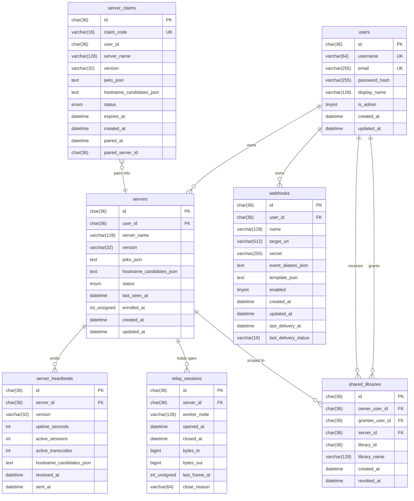

# Hub database schema

This document is the canonical reference for the `phlix-hub` MySQL
schema. The migration files in `migrations/` are the source of truth;
this doc explains the *why* and the *how it fits together*.

All tables:

- Use `ENGINE=InnoDB DEFAULT CHARSET=utf8mb4 COLLATE=utf8mb4_unicode_ci`.
- Have a `CHAR(36)` UUID primary key named `id`.
- Use `DATETIME` for timestamps (`created_at`, `updated_at`,
  `last_seen_at`, …) with `DEFAULT CURRENT_TIMESTAMP` and `ON UPDATE
  CURRENT_TIMESTAMP` where appropriate.

The hub deployment is **single-primary** — Group Replication
multi-primary mode is not supported because the schema relies on
`ON DELETE CASCADE` foreign keys that multi-primary rejects.

## Entity-relationship diagram

## Tables

### `users`

**Migration:** `001_users.sql`

The authoritative directory of hub accounts. Hub login (B.7) reads
from here; everything else (servers, sharing, webhooks) hangs off the
user row.

- `id` `CHAR(36)` — UUID, primary key.
- `username` `VARCHAR(64)` — unique, human-friendly handle.
- `email` `VARCHAR(255)` — unique.
- `password_hash` `VARCHAR(255)` — Argon2ID (PHP `password_hash`,
  `PASSWORD_ARGON2ID`).
- `display_name` `VARCHAR(128)` — optional friendly name.
- `is_admin` `TINYINT(1)` — `1` grants hub-admin UI access.
- `created_at`, `updated_at` `DATETIME`.

**Indexes:** primary `id`; unique `uk_users_username`; unique
`uk_users_email`.

**Read/write by:** signup, login, refresh, password reset
(B.7), the dashboard "me" page.

### `servers`

**Migrations:** `002_servers.sql`, `007_server_claims_and_servers.sql`,
`008_subdomain_allocation.sql`, `012_enrolled_at_and_last_frame_at.sql`

One row per Phlix server claimed to the hub. The hub does not store
library or media data here — only what's needed for relay
(`jwks_json`, `hostname_candidates_json`) and presence
(`status`, `last_seen_at`).

- `id` `CHAR(36)` — UUID, primary key.
- `user_id` `CHAR(36)` — owner, FK → `users.id` (CASCADE).
- `server_name` `VARCHAR(128)`.
- `version` `VARCHAR(32)` — last reported version (semver).
- `jwks_json` `TEXT` — the server's published JWKS, for verifying
  signed inbound requests.
- `hostname_candidates_json` `TEXT` — JSON array of candidate
  hostnames the hub may try to reach the server directly.
- `status` `ENUM('online','offline','claiming','disabled')`.
- `last_seen_at` `DATETIME` — last heartbeat receipt.
- `enrolled_at` `INT UNSIGNED NULL` — unix timestamp written when a
  paired claim is promoted into a `servers` row by
  `ClaimRequestHandler`. Nullable so rows that pre-date migration
  `012` (back-filled from `created_at`) and any future row that
  forgets to set it are still well-formed.
- `created_at`, `updated_at` `DATETIME`.

**Indexes:** primary `id`; `ix_servers_user_id`;
`ix_servers_last_seen`.

**Foreign keys:** `fk_servers_user` → `users.id` ON DELETE CASCADE.

**Read/write by:** `POST /api/v1/server-claims` (C.3),
`POST /api/v1/servers/{id}/heartbeat` (C.3), the dashboard server
list.

### `server_claims`

**Migration:** `002_servers.sql`

Pending or completed claim codes minted by the hub. The hub mints a
short code (`claim_code`, e.g. `"ABCD-1234"`), the user enters it on
the hub UI to bind a server to their account, the hub then promotes
the claim to a row in `servers`.

- `id` `CHAR(36)` — UUID, primary key (the opaque claim id).
- `claim_code` `VARCHAR(16)` — unique, human-pasteable code.
- `user_id` `CHAR(36)` — NULL until the claim is paired.
- `server_name`, `version`, `jwks_json`,
  `hostname_candidates_json` — captured from the server's claim
  request body; copied verbatim into the `servers` row on pairing.
- `status` `ENUM('pending','paired','expired','revoked')`.
- `expires_at` `DATETIME` — TTL for the claim code.
- `created_at`, `paired_at` `DATETIME`.
- `paired_server_id` `CHAR(36)` — set when the claim is paired;
  references `servers.id` but is **not** a hard FK because the
  server row is created lazily.

**Indexes:** primary `id`; unique `uk_server_claims_code`;
`ix_server_claims_status_expires` (for the GC cron).

**Read/write by:** `POST /api/v1/server-claims` (C.3),
`POST /api/v1/server-claims/{code}/pair` (C.3), expiration GC.

### `server_heartbeats`

**Migrations:** `002_servers.sql`, `006_server_heartbeats_sent_at.sql`

Recent heartbeats from each server. Used to power the dashboard's
"last activity" and "sessions / transcodes right now" widgets.

- `id` `CHAR(36)` — UUID.
- `server_id` `CHAR(36)` — FK → `servers.id` (CASCADE).
- `version`, `uptime_seconds`, `active_sessions`,
  `active_transcodes` — heartbeat payload.
- `hostname_candidates_json` `TEXT` — fresh hostname candidates the
  hub uses to refresh the parent `servers.hostname_candidates_json`.
- `received_at` `DATETIME` — hub clock, set on insert
  (`DEFAULT CURRENT_TIMESTAMP`).
- `sent_at` `DATETIME NULL` — server clock at heartbeat send time,
  populated from `HeartbeatDto::$timestamp`
  (`Phlix\Shared\Hub\HeartbeatDto`). Compared against `received_at`
  for clock-skew detection. Nullable because rows written before
  migration `006` (and any future heartbeat that omits the field)
  carry no server-side timestamp.

**Indexes:** primary `id`;
`ix_server_heartbeats_server_time (server_id, received_at)`.

**Foreign keys:** `fk_server_heartbeats_server` →
`servers.id` ON DELETE CASCADE.

**Retention:** keep last-N per server (cron pruning lands later);
treat any older row as discardable.

**Read/write by:** `POST /api/v1/servers/{id}/heartbeat` (C.3),
dashboard analytics.

### `shared_libraries`

**Migration:** `003_shared_libraries.sql`

Grant rows: "owner X lets grantee Y read library L on server S".
The `library_id` is the **server-side** library UUID — the hub does
not introspect the server's library tree.

- `id` `CHAR(36)` — UUID.
- `owner_user_id` `CHAR(36)` — FK → `users.id` (CASCADE).
- `grantee_user_id` `CHAR(36)` — FK → `users.id` (CASCADE).
- `server_id` `CHAR(36)` — FK → `servers.id` (CASCADE).
- `library_id` `CHAR(36)` — opaque to the hub.
- `library_name` `VARCHAR(128)` — denormalised display label.
- `created_at`, `revoked_at` `DATETIME` (`revoked_at` IS NULL
  means the grant is active).

**Indexes:** primary `id`;
unique `uk_shared_libraries (server_id, library_id, grantee_user_id)`;
`ix_shared_libraries_grantee`;
`ix_shared_libraries_owner`.

**Foreign keys:** three CASCADE FKs (owner, grantee, server).

**Read/write by:** `POST /api/v1/users/{id}/shared`,
`DELETE /api/v1/shared-libraries/{id}` (C.9), the dashboard's
"shared with me" list.

### `relay_sessions`

**Migrations:** `004_relay_sessions.sql`,
`012_enrolled_at_and_last_frame_at.sql`

Audit + dashboard rows for the WebSocket relay tunnel the hub
maintains with each server. One row per connection lifetime; byte
counters tick during the session, `closed_at` + `close_reason`
finalise it on disconnect.

- `id` `CHAR(36)` — UUID.
- `server_id` `CHAR(36)` — FK → `servers.id` (CASCADE).
- `worker_node` `VARCHAR(128)` — which hub worker terminates the
  WS (matters in multi-node deployments).
- `opened_at`, `closed_at` `DATETIME`.
- `bytes_in`, `bytes_out` `BIGINT UNSIGNED`.
- `last_frame_at` `INT UNSIGNED NULL` — unix timestamp of the most
  recent frame seen in either direction. Updated by
  `RelaySessionManager::recordBytesIn()` /
  `recordBytesOut()`. Nullable because sessions opened before
  migration `012` have no per-frame activity data.
- `close_reason` `VARCHAR(64)` — `"client-disconnect"`,
  `"timeout"`, `"server-shutdown"`, etc.

**Indexes:** primary `id`;
`ix_relay_sessions_server (server_id, opened_at)`;
`ix_relay_sessions_open (server_id, closed_at)`.

**Foreign keys:** `fk_relay_sessions_server` →
`servers.id` ON DELETE CASCADE.

**Read/write by:** `/api/v1/servers/{id}/relay` (C.6),
dashboard bandwidth analytics.

### `webhooks`

**Migration:** `005_webhooks.sql`

User-defined HTTP callbacks the hub delivers when a subscribed
event alias fires. Event aliases are the `phlix.*` strings from
`Phlix\Shared\Plugin\EventNameMap`.

- `id` `CHAR(36)` — UUID.
- `user_id` `CHAR(36)` — FK → `users.id` (CASCADE).
- `name` `VARCHAR(128)` — user label.
- `target_url` `VARCHAR(512)`.
- `secret` `VARCHAR(255)` — HMAC signing secret, optional.
- `event_aliases_json` `TEXT` — JSON array of `phlix.*` aliases.
- `template_json` `TEXT` — handlebars body template (added in
  L.1).
- `enabled` `TINYINT(1)`.
- `created_at`, `updated_at`, `last_delivery_at` `DATETIME`.
- `last_delivery_status` `VARCHAR(16)` — `"ok"`, `"4xx"`,
  `"5xx"`, `"timeout"`.

**Indexes:** primary `id`; `ix_webhooks_user`.

**Foreign keys:** `fk_webhooks_user` → `users.id` ON DELETE
CASCADE.

**Read/write by:** `/api/v1/webhooks/*` (L.1+), the webhook
dispatcher worker.

## Migration runner

`scripts/run-migrations.php` wraps
`Phlix\Hub\Common\Database\MigrationRunner`. The runner:

1. Creates a `migrations` tracking table on first run
   (`CREATE TABLE IF NOT EXISTS migrations (filename VARCHAR(255)
   PRIMARY KEY, applied_at DATETIME DEFAULT CURRENT_TIMESTAMP)`).
2. Discovers `migrations/*.sql` in lexicographic order.
3. For each file not yet in the tracking table:
   - Strips `--` comments and blank lines.
   - Splits on `;` into individual statements.
   - Executes each statement.
   - Inserts a row into `migrations` once the file completes.
4. Re-running is a no-op (idempotent).

Every business-table file also uses `CREATE TABLE IF NOT EXISTS`
as a belt-and-braces guard for the case where the tracking table
is dropped but the schema persists.

## Test environment

The integration test
(`tests/Integration/Migrations/MigrationRunnerIntegrationTest.php`)
applies all five migrations against a real MySQL test database
configured via `HUB_TEST_DB_*` environment variables and asserts:

- Every business table exists after the run.
- Re-running the runner applies nothing new.
- The `uk_users_email` unique constraint rejects duplicate emails.
- `fk_servers_user` cascades on user delete.
- All seven foreign-key constraint names are present in
  `information_schema.TABLE_CONSTRAINTS`.

The suite is **skipped** automatically when:

- `HUB_TEST_DB_*` is not set, **or**
- the test database runs MySQL Group Replication with
  `group_replication_enforce_update_everywhere_checks=ON` (which
  forbids CASCADE foreign keys).
