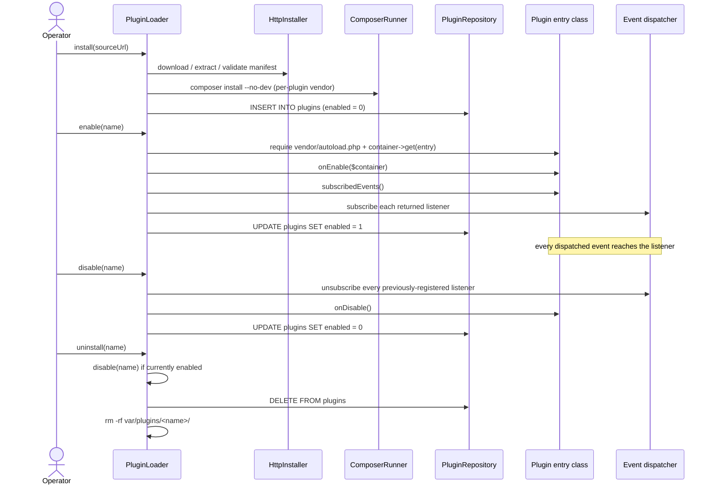

# Phlix plugin developer guide

This is the end-to-end guide for authoring a Phlix plugin. Read it
top-to-bottom once and you'll have everything you need to ship a
working plugin: pick a type, declare the manifest, implement the
lifecycle contract, subscribe to events, package, sign (optional),
publish, and install through the admin UI.

Phase A of `PHLIX_EXPANSION_PLAN.md` (internal planning doc)
delivers the **loader, manifest, lifecycle, signature, admin UI, and
reference plugin**. Everything documented here works today (as of the
Phase A.7 release); sections that anticipate later phases are flagged
explicitly.

## Table of contents

1. [Overview](#1-overview)
2. [Plugin types](#2-plugin-types)
3. [Manifest reference](#3-manifest-reference)
4. [Lifecycle reference](#4-lifecycle-reference)
5. [Event subscription](#5-event-subscription)
6. [Settings](#6-settings)
7. [Walkthrough: the example plugin](#7-walkthrough-the-example-plugin)
8. [Packaging your plugin](#8-packaging-your-plugin)
9. [Signing](#9-signing)
10. [Testing your plugin locally](#10-testing-your-plugin-locally)
11. [Publishing](#11-publishing)
12. [Reference](#12-reference)

---

## 1. Overview

A **plugin** is an independently-deployed PHP package that the Phlix
server discovers, validates, autoloads, and wires into its PSR-11
container and PSR-14 dispatcher at runtime. Plugins are the supported
extension point for everything that's not core to the media server
itself — scrobblers, alternative metadata providers, auth backends,
analytics sinks, custom transcoder hooks, and so on.

Concretely, every plugin ships:

- A `plugin.json` manifest describing the plugin's identity, version
  bounds, type, entry class, settings, and subscribed events.
- A `composer.json` declaring its autoload map and its runtime
  dependencies. The loader runs `composer install --no-dev` into a
  per-plugin `vendor/` directory so plugins don't pollute the host's
  dependency tree.
- One PHP entry class implementing
  `Phlix\Shared\Plugin\LifecycleInterface` (the legacy
  `Phlix\Plugins\Contract\LifecycleInterface` FQCN still works as a
  deprecated bridge through 0.11.x). The loader instantiates
  it through the host container, calls `onEnable()` on enable, and
  unsubscribes its listeners + calls `onDisable()` on disable.

The plugin system is designed so that a **single GitHub repository**
is the entire deliverable: an admin pastes a URL into the admin UI,
the server downloads, validates, installs, and the plugin lights up on
the next enable click. No restart, no FTP, no manual file copying.

### Who plugins are for

- **Phlix operators** running their own server who want to integrate
  with a third-party service (Trakt, Last.fm, Sonarr, Discord, Slack,
  …) without forking the core.
- **Service authors** who want to make their backend Phlix-aware
  without convincing core to take a hard dependency on it.
- **UI / theme authors** who want to restyle the web portal.
- **Storage and library experiments** that don't belong in the
  default scanner pipeline yet.

If you find yourself wanting to add a `case Trakt:` to an enum in
`src/`, that's a plugin instead.

---

## 2. Plugin types

The `type` field in `plugin.json` is an enum of eleven values. Each
type maps to a category of integration; the table below cross-walks
each type with its typical PSR-14 event subscriptions and current
implementation status.

> **Implementation status today (Phase A complete):** the loader
> instantiates and dispatches events to plugins of every type uniformly
> — there is no type-specific dispatch path yet. The reference
> `phlix-plugin-example` is a `metadata-provider` shell that
> demonstrates the lifecycle but is not yet invoked by
> `MetadataManager`. Type-specific dispatch (e.g. the metadata manager
> falling through to plugins for unknown providers) lands as each
> subsystem is wired up over Phases C–L.

| `type` value         | Use case                                                       | Typical events subscribed                                                                  | Implemented today                                          |
| -------------------- | -------------------------------------------------------------- | ------------------------------------------------------------------------------------------ | ---------------------------------------------------------- |
| `metadata-provider`  | Pulls media metadata (alternative TMDb, AniDB, MusicBrainz…)   | `phlix.library.item.added` (refresh-on-add)                                                | Loader yes; manager dispatch wired in Phase C              |
| `subtitle-provider`  | Downloads or generates subtitles                               | `phlix.library.item.added`, `phlix.playback.started`                                       | Loader yes; subtitle pipeline wired in Phase C             |
| `auth-provider`      | Authenticates users (OIDC, LDAP, SSO)                          | `phlix.user.created`, `phlix.user.logged_in`                                               | Loader yes; pluggable auth backend wired in Phase D        |
| `library-type`       | Adds a brand-new library kind (comics, audiobooks, …)          | `phlix.library.scan.started`, `phlix.library.scan.completed`                               | Loader yes; library-type registry wired in Phase E         |
| `notifier`           | Sends notifications (push, email, chat)                        | `phlix.library.item.added`, `phlix.user.created`, `phlix.playback.started`                 | Loader yes; notifier dispatch live via PSR-14 today        |
| `scrobbler`          | Reports playback to an external service (Trakt, Last.fm)       | `phlix.playback.started`, `phlix.playback.paused`, `phlix.playback.resumed`, `phlix.playback.stopped` | Loader yes; scrobbling live via PSR-14 today               |
| `tuner`              | Live-TV tuner backend (HDHomeRun, IPTV, …)                     | rarely subscribes — usually exposes a polled API                                           | Loader yes; tuner registry wired in Phase F                |
| `transcoder-hook`    | Adjusts the FFmpeg transcoder pipeline                         | rarely subscribes — usually exposes a filter API                                           | Loader yes; transcoder hook points wired in Phase G        |
| `ui-theme`           | Restyles the web portal                                        | none                                                                                       | Loader yes; theme registry wired in Phase H                |
| `arr-integration`    | Integrates with the *arr stack (Sonarr, Radarr)                | `phlix.library.scan.completed`, `phlix.library.item.added`                                 | Loader yes; webhook bridge wired in Phase I                |
| `analytics-sink`     | Exports analytics to external systems                          | every event the operator wants to mirror                                                   | Loader yes; sinks live via PSR-14 today                    |

**Pragmatically**, today (Phase A) you can ship any of the
**"live via PSR-14"** types — `notifier`, `scrobbler`, and
`analytics-sink` — and they will fire on real events the moment they
are enabled. The other types install and enable cleanly but their
host-side integration points arrive in later phases. The reference
plugin is deliberately the simplest case: a `metadata-provider` shell
that just demonstrates the lifecycle.

See also: [`manifest.md`](manifest.md) for the enum's canonical home.

---

## 3. Manifest reference

The manifest is a single `plugin.json` at the root of your plugin
repository. Its full schema lives in
[`manifest.schema.json`](manifest.schema.json) and the human-readable
field-by-field reference is in [`manifest.md`](manifest.md). The
relevant highlights for plugin authors:

### Canonical example

This is the example from `PHLIX_EXPANSION_PLAN.md` §5 — the
authoritative shape of a plugin manifest:

```json
{
    "name": "phlix-plugin-lastfm",
    "version": "1.0.0",
    "phlix_min_server_version": "0.10.0",
    "type": "scrobbler",
    "entry": "Phlix\\Plugins\\Lastfm\\Plugin",
    "events": ["phlix.playback.started", "phlix.playback.stopped"],
    "settings": {
        "api_key": { "type": "string", "required": true, "secret": true },
        "api_secret": { "type": "string", "required": true, "secret": true }
    },
    "signature": "sha256:..."
}
```

### Required fields at a glance

- `name` — kebab-case, **must start with `phlix-plugin-`** (regex
  `^phlix-plugin-[a-z0-9][a-z0-9-]*$`, max 64 chars). The loader
  refuses any plugin whose name does not match this prefix because
  the name is also used as a filesystem path component under
  `var/plugins/<name>/`. Pick the name carefully — it is the
  plugin's identity for the lifetime of the install.
- `version` — semver of the plugin itself (regex
  `^\d+\.\d+\.\d+(?:[-+][A-Za-z0-9.\-]+)?$`). Bump it every release.
- `phlix_min_server_version` — minimum Phlix server semver the plugin
  is compatible with. The loader refuses to install when the running
  server's `Phlix\Common\Version::STRING` is older than this value.
  Start at `0.10.0` (the release that introduced the plugin system).
- `type` — one of the eleven values from
  [§2](#2-plugin-types).
- `entry` — fully-qualified class name of your plugin's entry class.
  Must match `^[A-Z][A-Za-z0-9_]*(?:\\[A-Z][A-Za-z0-9_]*)+$`. The
  loader resolves this through the host PSR-11 container, so the
  class must be autoloadable from your `composer.json`.

### Optional fields

- `events` — list of **manifest aliases** (e.g.
  `phlix.playback.started`). The loader translates each alias to the
  matching event FQCN through
  `Phlix\Plugins\EventNameMap` at enable time. The complete alias →
  FQCN table is in [`docs/dev/event-reference.md`](../dev/event-reference.md).
  Plugins that subscribe via `subscribedEvents()` rather than via
  the manifest can leave this empty (the manifest list is currently
  informational — the dispatcher only reacts to what
  `subscribedEvents()` returns).
- `settings` — keyed object describing operator-facing knobs. See
  [§6](#6-settings).
- `signature` — `sha256:<64-hex>` digest, or `null` for unsigned
  plugins. See [§9](#9-signing).

For full field-level details, validation rules, and error codes
returned from `Manifest::validate()`, read
[`manifest.md`](manifest.md).

---

## 4. Lifecycle reference

Every plugin entry class implements
`Phlix\Shared\Plugin\LifecycleInterface` (in the `detain/phlix-shared`
Composer package, since `phlix-server` 0.11.0).

> **Migrating from 0.10.x.** Plugins compiled against
> `Phlix\Plugins\Contract\LifecycleInterface` keep working in 0.11.x
> because the old FQCN is a deprecated `interface … extends …` bridge.
> The shim is removed in 0.12.0 — update your imports at your earliest
> convenience.

```php
namespace Phlix\Shared\Plugin;

use Psr\Container\ContainerInterface;

interface LifecycleInterface
{
    public function onEnable(ContainerInterface $container): void;

    public function onDisable(): void;

    /** @return array<class-string, string|callable> */
    public function subscribedEvents(): array;
}
```

### Lifecycle stages



### Method contracts

#### `onEnable(ContainerInterface $container): void`

Runs once, after the manifest is loaded, the plugin's
`vendor/autoload.php` is registered, and the loader has resolved the
entry class through the host PSR-11 container.

- The container parameter is the **host** container — every binding
  that `Phlix\Common\Container\ContainerFactory` produces is
  resolvable, including loggers, the DB connection, the listener
  registry, and the `AuthManager` / `ItemRepository` services. See
  [`docs/dev/plugin-sdk.md`](../dev/plugin-sdk.md#1-container-bindings-plugins-can-resolve)
  for the catalog of container IDs.
- Throwing from `onEnable()` aborts enabling — the loader wraps the
  throwable in
  `Phlix\Plugins\Exception\PluginEnableException` and surfaces it to
  the operator UI. The plugin row stays installed but `enabled = 0`.
- Keep this method **cheap and non-blocking**. Heavy work (HTTP
  warmup, polling background workers) belongs in the listeners
  themselves, which only run when a relevant event fires.

#### `subscribedEvents(): array`

Returns a map keyed by **event class FQCN** (e.g.
`PlaybackStarted::class`) to either:

- A **method name** (string) on `$this`. The loader binds it as
  `[$pluginInstance, $methodName]`.
- A **PHP callable** — closure, invokable object, `[$obj, 'method']`,
  `'free_function'`, etc.

The loader translates manifest aliases (`phlix.playback.started`) to
FQCNs through `Phlix\Plugins\EventNameMap` before calling this method,
so plugin authors deal exclusively with FQCNs at runtime.

If an entry in the returned map references a class that doesn't exist,
or a method name the plugin doesn't implement, the loader throws
`PluginEnableException` with a precise message.

#### `onDisable(): void`

Runs once, after the loader has unsubscribed every listener
previously returned from `subscribedEvents()`. Use it to flush queued
state, close HTTP clients, cancel background workers, etc.

- Exceptions are **caught and logged** but the disable still
  completes (the loader writes a warning to the `plugins` log channel
  and proceeds to flip `enabled = 0` regardless). This is intentional:
  a broken `onDisable()` should never lock a plugin into the enabled
  state.
- The same instance that received `onEnable()` receives `onDisable()`
  — the loader caches `entryInstances[<name>]` between the two calls.

### Auto-enable on boot

The bootstrap path
(`Phlix\Common\Container\Providers\PluginsProvider` →
`PluginLoader::bootstrapEnabled()`) re-enables every plugin with
`plugins.enabled = 1` after the container is built. Per-plugin
failures are logged to the `plugins` channel but **do not** block
other plugins from coming up — one broken plugin cannot take down the
server.

---

## 5. Event subscription

Phlix uses [`Crell\Tukio`](https://github.com/Crell/Tukio) as its
PSR-14 implementation. The loader wires your plugin's
`subscribedEvents()` map into Tukio by calling
`Phlix\Common\Events\ListenerRegistry::subscribe()` for every entry
and stashes the resulting callables so `disable()` can call
`unsubscribe()` for exactly the same callables.

### Twelve events live today

The canonical event catalog is
[`docs/dev/event-reference.md`](../dev/event-reference.md). The
twelve events the server publishes today are:

| Manifest alias                  | Event class FQCN                                       |
| ------------------------------- | ------------------------------------------------------ |
| `phlix.playback.started`        | `Phlix\Shared\Events\Playback\PlaybackStarted`         |
| `phlix.playback.paused`         | `Phlix\Shared\Events\Playback\PlaybackPaused`          |
| `phlix.playback.resumed`        | `Phlix\Shared\Events\Playback\PlaybackResumed`         |
| `phlix.playback.stopped`        | `Phlix\Shared\Events\Playback\PlaybackStopped`         |
| `phlix.library.scan.started`    | `Phlix\Shared\Events\Library\LibraryScanStarted`       |
| `phlix.library.scan.completed`  | `Phlix\Shared\Events\Library\LibraryScanCompleted`     |
| `phlix.library.item.added`      | `Phlix\Shared\Events\Library\MediaItemAdded`           |
| `phlix.library.item.updated`    | `Phlix\Shared\Events\Library\MediaItemUpdated`         |
| `phlix.library.item.removed`    | `Phlix\Shared\Events\Library\MediaItemRemoved`         |
| `phlix.user.created`            | `Phlix\Shared\Events\Auth\UserCreated`                 |
| `phlix.user.logged_in`          | `Phlix\Shared\Events\Auth\UserLoggedIn`                |
| `phlix.user.logged_out`         | `Phlix\Shared\Events\Auth\UserLoggedOut`               |

Each event extends `Phlix\Shared\Events\AbstractEvent` and exposes
an `int $timestamp` (UNIX seconds at construction). All other payload
fields are documented per-event in `event-reference.md`.

### Worked example

A minimal scrobbler that fires on playback start and stop:

```php
namespace Phlix\Plugins\Lastfm;

use Phlix\Shared\Events\Playback\PlaybackStarted;
use Phlix\Shared\Events\Playback\PlaybackStopped;
use Phlix\Shared\Plugin\LifecycleInterface;
use Psr\Container\ContainerInterface;
use Psr\Log\LoggerInterface;

final class Plugin implements LifecycleInterface
{
    private ?LoggerInterface $logger = null;
    private ?LastfmClient $client = null;

    public function onEnable(ContainerInterface $container): void
    {
        $this->logger = $container->get(LoggerInterface::class);
        $this->client = new LastfmClient(/* config from settings */);
    }

    public function onDisable(): void
    {
        $this->client = null;
    }

    public function subscribedEvents(): array
    {
        return [
            PlaybackStarted::class => 'onPlaybackStarted',
            PlaybackStopped::class => 'onPlaybackStopped',
        ];
    }

    public function onPlaybackStarted(PlaybackStarted $event): void
    {
        $this->client?->nowPlaying($event->userId, $event->mediaItemId);
    }

    public function onPlaybackStopped(PlaybackStopped $event): void
    {
        if ($event->reachedEnd) {
            $this->client?->scrobble($event->userId, $event->mediaItemId);
        }
    }
}
```

### Debugging event delivery

Set the env var `PHLIX_DEBUG_EVENTS=1` (truthy values: `1`, `true`,
`yes`, `on`) and every dispatched event lands at debug level on the
`events` channel — `.logs/events.log` by default. This is the fastest
way to confirm that your listener is actually being called.

### Immutability

Every event class is a `readonly` DTO. Listeners must **not** mutate
the payload (the underlying PHP types make this a hard error
anyway). If your plugin needs to influence downstream behaviour,
either talk directly to the relevant service through the container or
wait for a phase that introduces a typed extension point.

See also: [`event-reference.md`](../dev/event-reference.md) and
[`docs/dev/plugin-sdk.md`](../dev/plugin-sdk.md).

---

## 6. Settings

The `settings` block in the manifest declares operator-facing knobs
for your plugin. Each key is a setting name; each value is a small
schema object:

```json
"settings": {
    "api_key":   { "type": "string", "required": true, "secret": true },
    "max_items": { "type": "int",    "required": false, "default": 50 },
    "feature_x_on": { "type": "bool", "default": false }
}
```

| Key        | Type    | Notes                                                                  |
| ---------- | ------- | ---------------------------------------------------------------------- |
| `type`     | string  | Required. One of `string`, `int`, `bool`, `float`, `array`.            |
| `required` | boolean | Whether the operator must set a value. Default `false`.                |
| `secret`   | boolean | Hides the value in UI/logs and stores it encrypted (planned). Default `false`. |
| `default`  | any     | Default value when the operator leaves the field blank.                |

### Persistence

When `PluginLoader::install()` finishes, it materialises the default
values from the manifest (`$schema['default']` for every key that
declares one) and persists them as JSON in `plugins.settings_json`
through `PluginRepository::insert()`. At runtime, the
`InstalledPlugin` DTO returned from `PluginLoader::listInstalled()` /
`getEnabled()` exposes the persisted values as `$installed->settings`
— a `array<string, mixed>` keyed by setting name.

### Reading a setting at runtime

In Phase A the cleanest way for a plugin to read its own settings is
to inject the host container and ask the repository for its row:

```php
public function onEnable(ContainerInterface $container): void
{
    $repo = $container->get(\Phlix\Plugins\Repository\PluginRepository::class);
    $installed = $repo->findByName('phlix-plugin-lastfm');
    $this->apiKey = (string) ($installed->settings['api_key'] ?? '');
}
```

The manifest schema for the live install is available as
`$installed->manifest->settings` — useful if you need to discover the
declared default at runtime.

> **Editable settings UI is forthcoming.** The A.5 admin UI renders
> settings **read-only**, with `secret: true` fields masked. The
> in-product editor for plain (non-secret) settings is parked for a
> later Phase A.x / B step; until then, settings ship with their
> manifest defaults and can only be changed by updating
> `plugins.settings_json` directly or by reinstalling the plugin with
> a new default in the manifest.

### Secrets

`secret: true` is a **declaration**, not yet a full encryption
contract. Today the loader respects the flag by masking the value in
admin-UI rendering. End-to-end at-rest encryption of the
`settings_json` column is on the Phase B backlog (it depends on a key
management story that arrives with `phlix-shared`). Until then, treat
`secret: true` as "do not log this and do not display it in the
table", but assume the value is plaintext on disk.

---

## 7. Walkthrough: the example plugin

`detain/phlix-plugin-example` is the canonical fork-as-starter
template. It's a `metadata-provider` shell that implements the
lifecycle contract, exposes one configurable setting, and ships with
its own PHPUnit suite plus a `dev-stubs/` directory so plugin tests
can run **without** phlix-server on the classpath.

### Clone it

```bash
git clone https://github.com/detain/phlix-plugin-example.git my-plugin
cd my-plugin
```

### File-by-file tour

```
my-plugin/
├── plugin.json              # the manifest
├── composer.json            # autoload map + runtime deps
├── src/
│   └── HelloMetadataProvider.php   # the entry class
├── dev-stubs/
│   └── LifecycleInterface.php      # byte-compatible stub of the host interface
├── tests/                   # PHPUnit suite
├── phpunit.xml              # test runner config
├── README.md
└── LICENSE
```

#### `plugin.json`

The published manifest:

```json
{
    "name": "phlix-plugin-example",
    "version": "0.1.0",
    "phlix_min_server_version": "0.10.0",
    "type": "metadata-provider",
    "entry": "Phlix\\PluginExample\\HelloMetadataProvider",
    "events": [],
    "settings": {
        "greeting": {
            "type": "string",
            "required": false,
            "default": "Hello, World"
        }
    },
    "signature": null
}
```

`events: []` because metadata providers don't yet subscribe via
PSR-14 — the future `MetadataManager` will iterate registered
providers directly. `signature: null` is deliberate: the plugin is
meant to be forked, so pinning its hash to an allowlist would be
misleading.

#### `composer.json`

```json
{
    "name": "phlix/plugin-example",
    "type": "phlix-plugin",
    "license": "MIT",
    "require": {
        "php": ">=8.1",
        "psr/container": "^1.1 || ^2.0"
    },
    "autoload": {
        "psr-4": {
            "Phlix\\PluginExample\\": "src/"
        }
    }
}
```

A few things worth noting:

- `type` is `phlix-plugin`, which is purely informational — no
  Composer installer plugin reads it today, but it's a convention
  that lets the wider ecosystem identify Phlix plugins from their
  `composer.json`.
- The PSR-4 autoload map matches the namespace used in the manifest's
  `entry` field.
- The plugin declares **`psr/container: ^1.1 || ^2.0`** as a soft
  range so it imports cleanly into hosts that pin to either major.
  The host container is `^2.0` today; if your plugin needs strict
  PSR-11 v2 features, narrow the range.

#### `src/HelloMetadataProvider.php`

The entry class — `final`, implements `LifecycleInterface`, and
keeps `onEnable()` cheap (stashes the container and that's it).
`subscribedEvents()` returns `[]` because this shell plugin doesn't
listen to events. The `lookup()` method returns the configured
greeting for the fixed fixture path so the integration test in
`tests/` can assert the install-enable-call-disable round-trip works.

#### `dev-stubs/LifecycleInterface.php`

A **byte-compatible** stub of the shared `Phlix\Shared\Plugin\LifecycleInterface`
(or, for plugins still pinned to 0.10.x, the legacy
`Phlix\Plugins\Contract\LifecycleInterface`) so the plugin's PHPUnit
suite can run on developer machines that don't have a phlix-server
checkout on the include path. `tests/bootstrap.php` autoloads this
stub when the canonical class isn't already loaded. See
[§10](#10-testing-your-plugin-locally) for the pattern.

### Install it on a running server

With the plugin admin UI from A.5 enabled, paste this URL into
**Admin → Plugins → Install from URL** and click **Install**:

```
https://raw.githubusercontent.com/detain/phlix-plugin-example/main/plugin.json
```

Or via the JSON API:

```bash
TOKEN="…your admin bearer token…"

curl -sS -X POST https://phlix.example.com/api/v1/admin/plugins/install \
     -H "Authorization: Bearer $TOKEN" \
     -H "Content-Type: application/json" \
     -d '{"url": "https://raw.githubusercontent.com/detain/phlix-plugin-example/main/plugin.json"}'
```

After install, flip the toggle for `phlix-plugin-example` in the
plugins table to enable it. The `onEnable()` hook fires immediately;
re-disabling the toggle calls `onDisable()`.

For the operator-facing detail, see [`install-from-url.md`](install-from-url.md).

---

## 8. Packaging your plugin

### Where to host

GitHub is the supported path today. Tag releases (`v0.1.0`, `v0.2.0`,
…) so operators can pin to a specific commit through the raw URL.

The loader accepts three URL flavours pointing at your release:

- **A direct `plugin.json` URL** (recommended). The loader fetches the
  manifest first, validates it, then either treats the URL as the
  install source directly or follows a `source` field inside the
  manifest to a tarball/zip if present. For a single-repo plugin
  published on GitHub `main`, the canonical install URL is:

  ```
  https://raw.githubusercontent.com/<owner>/<repo>/<ref>/plugin.json
  ```

  Replace `<ref>` with a tag (`v0.1.0`) to pin, or `main` for the
  rolling head.

- **A `.tar.gz` or `.tgz` URL** — the loader fetches and extracts
  with PHP's `PharData`. Useful for GitHub release tarballs.

- **A `.zip` URL** — the loader fetches and extracts with PHP's
  `ZipArchive`.

The loader **flattens single-root archives** automatically, so a
GitHub tarball that unpacks to `<repo>-<sha>/` will end up with
`plugin.json` at the staging root, as the loader expects.

### `composer.json` requirements

- **PSR-4 autoload map.** The loader's `ComposerRunner` runs
  `composer install --no-dev` inside the plugin directory; whatever
  classes you reference from `plugin.json#/entry` must be reachable
  through that autoload map.
- **`psr/container` as a soft range.** Declare
  `"psr/container": "^1.1 || ^2.0"` so the plugin can install against
  hosts that pin to either major. The host container is `^2.0` today.
  Do **not** depend on a specific version of `psr/container` — the
  host always provides one.
- **Pin PHP `>=8.1`.** The host requires PHP 8.3 but pinning the
  plugin to 8.1 maximises the matrix of dev environments that can
  build it.
- **`require-dev` is dropped at install time** — the `--no-dev` flag
  on the install command means your `phpunit/phpunit` and similar
  tooling deps never reach the production sandbox. Use that to keep
  the per-plugin `vendor/` lean.

### Sandbox layout

Each installed plugin lives at:

```
var/plugins/<plugin-name>/
├── plugin.json
├── composer.json
├── composer.lock
├── src/...
└── vendor/                 # produced by the loader's composer install
```

The base directory defaults to `var/plugins/` relative to the project
root; override it by setting `plugins_base_dir` in
`config/server.php`.

---

## 9. Signing

Plugin signing in Phase A is intentionally minimal — a one-line
`sha256:<64-hex>` digest in the manifest's `signature` field, checked
against a trusted-key allowlist on install. The Phase C hub will layer
a real, key-rotation-aware signing infrastructure on top; until then,
this is the contract.

### Signature format

```
"signature": "sha256:9f86d081884c7d659a2feaa0c55ad015a3bf4f1b2b0b822cd15d6c15b0f00a08"
```

The regex `^sha256:[0-9a-f]{64}$` is enforced by
[`manifest.schema.json`](manifest.schema.json). Anything else fails
manifest validation.

### Computing a signature

There is no canonical "what bytes does the digest cover" specification
yet — the current `SignatureVerifier` only checks the literal string
against the allowlist (it does not re-hash the on-disk bytes). The
recommended convention until the hub ships is to publish the digest of
your **`plugin.json` file with the `signature` field set to `null`**:

```bash
# 1. publish plugin.json with "signature": null
shasum -a 256 plugin.json
# 2. paste the resulting 64-hex digest in as "signature": "sha256:<hex>"
```

This convention is portable across hosts and platforms (`shasum -a
256` on macOS / Linux, `Get-FileHash` on Windows) and matches what the
hub will adopt in Phase C.

### Verifier outcomes

The host's `Phlix\Plugins\Signature\SignatureVerifier` returns one of
three results per install:

| Manifest state                  | `PHLIX_PLUGINS_REQUIRE_SIGNATURE` | Result    | Loader behaviour                                                |
| ------------------------------- | --------------------------------- | --------- | --------------------------------------------------------------- |
| Signature present, on allowlist | any                               | `valid`   | Install proceeds.                                               |
| Signature present, allowlist empty | unset / `0`                    | `valid`   | Install proceeds (warning-free).                                |
| Signature present, allowlist empty | `1`                            | `invalid` | Install fails, staged directory removed.                        |
| Signature present, not on allowlist | any (when allowlist non-empty) | `invalid` | Install fails, staged directory removed.                        |
| No signature                    | unset / `0`                       | `unsigned`| Install proceeds; loader logs a `warning` on the `plugins` channel. |
| No signature                    | `1`                               | `invalid` | Install fails.                                                  |

The only env var honoured today is **`PHLIX_PLUGINS_REQUIRE_SIGNATURE`**.
When unset or falsy (the default) unsigned plugins install with a
warning on the `plugins` log channel; set it to `1`, `true`, `yes`, or
`on` to refuse unsigned installs.

### Registering a trusted key

Until the in-product UI ships, the trusted-key allowlist is
operator-configured in code by overriding the container binding for
`SignatureVerifier`:

```php
$builder->addDefinitions([
    \Phlix\Plugins\Signature\SignatureVerifier::class => DI\factory(
        static fn (): \Phlix\Plugins\Signature\SignatureVerifier =>
            new \Phlix\Plugins\Signature\SignatureVerifier(
                trustedSignatures: [
                    'sha256:9f86d081884c7d659a2feaa0c55ad015a3bf4f1b2b0b822cd15d6c15b0f00a08',
                ],
                requireSignature: false,
            ),
    ),
]);
```

See [`trusted-plugin-list.md`](trusted-plugin-list.md) for the full
operator playbook. The community process for getting a plugin onto a
**shared, hub-distributed** allowlist is **forthcoming** — it lands
in Phase C alongside the hub itself. Don't oversell signing yet:
today's contract is "the operator vouches for what they install" plus
a defence-in-depth digest check.

---

## 10. Testing your plugin locally

### Unit tests inside the plugin repo

Use the `dev-stubs/` pattern from the example plugin so your test
suite has no hard dependency on a checked-out phlix-server:

```php
// dev-stubs/LifecycleInterface.php
namespace Phlix\Plugins\Contract;

use Psr\Container\ContainerInterface;

interface LifecycleInterface
{
    public function onEnable(ContainerInterface $container): void;
    public function onDisable(): void;

    /** @return array<class-string, string|callable> */
    public function subscribedEvents(): array;
}
```

And in `tests/bootstrap.php`:

```php
<?php
require __DIR__ . '/../vendor/autoload.php';

// Only fall back to the stub when the real interface isn't on the classpath.
if (!interface_exists(\Phlix\Plugins\Contract\LifecycleInterface::class, true)) {
    require __DIR__ . '/../dev-stubs/LifecycleInterface.php';
}
```

`phpunit.xml`:

```xml
<phpunit bootstrap="tests/bootstrap.php" colors="true">
    <testsuites>
        <testsuite name="default">
            <directory>tests</directory>
        </testsuite>
    </testsuites>
</phpunit>
```

Now `composer install && ./vendor/bin/phpunit` works in any clean
checkout of your plugin, no Phlix server required.

### End-to-end install against a real Phlix server (local)

Two paths are supported today:

#### A. Install from a local directory

If you have phlix-server checked out and your plugin lives next to
it, use `installFromDirectory()` instead of going through HTTP:

```bash
cd /path/to/phlix
php -r '
require "vendor/autoload.php";
$container = (new \Phlix\Common\Container\ContainerFactory())
    ->create(require __DIR__."/config/server.php");
$loader = $container->get(\Phlix\Plugins\PluginLoader::class);
$manifest = $loader->installFromDirectory("/path/to/my-plugin");
$loader->enable($manifest->name);
echo "enabled\n";
'
```

This skips the download / extract step entirely — the loader copies
the directory tree directly into `var/plugins/<name>/`, runs composer,
and inserts the row.

#### B. Install from a `file://` URL (HTTP-installer path)

Useful when you want to exercise the same code path the admin UI uses
without exposing the plugin to the network. Stage a tarball locally:

```bash
cd /path/to/my-plugin
tar czf /tmp/my-plugin.tar.gz --transform 's,^,my-plugin/,' \
    plugin.json composer.json src dev-stubs
```

Then install:

```bash
php -r '
require "vendor/autoload.php";
$container = (new \Phlix\Common\Container\ContainerFactory())
    ->create(require __DIR__."/config/server.php");
$loader = $container->get(\Phlix\Plugins\PluginLoader::class);
$loader->install("file:///tmp/my-plugin.tar.gz");
'
```

The `file://` scheme is always allowed (unlike `http://`, which
requires `PHLIX_PLUGINS_ALLOW_HTTP=1`).

### Verifying the install

After install:

```bash
mysql -e 'SELECT name, version, enabled, installed_at FROM plugins ORDER BY installed_at DESC LIMIT 5'
ls var/plugins/my-plugin/                   # plugin.json, composer.json, src/, vendor/
tail -f .logs/plugins.log                   # watch for enable / disable events
PHLIX_DEBUG_EVENTS=1 php public/index.php   # watch event delivery in .logs/events.log
```

---

## 11. Publishing

Once your plugin is in shape:

1. **Push to GitHub.** A single repository per plugin keeps install
   URLs short and predictable.
2. **Tag a release.** `git tag v0.1.0 && git push origin v0.1.0`. The
   tag becomes the `<ref>` segment of pinned install URLs.
3. **Update `phlix_min_server_version`** in `plugin.json` if you've
   started depending on a feature introduced in a newer Phlix
   release.
4. **Share the install URL.** Operators paste:

   ```
   https://raw.githubusercontent.com/<owner>/<repo>/v0.1.0/plugin.json
   ```

   into the admin UI's **Install from URL** field. That's it.

For now, plugin distribution lives in the operator's manual workflow.
The in-product **catalog** (a curated, browsable list of trusted
plugins fetched from the Phlix hub) ships with **Phase C**; until
then, install-from-URL is the supported install path.

---

## 12. Reference

### Documentation

- [`docs/plugins/manifest.md`](manifest.md) — full manifest spec.
- [`docs/plugins/manifest.schema.json`](manifest.schema.json) — the
  JSON Schema used by `Manifest::validate()` and CI linters.
- [`docs/plugins/install-from-url.md`](install-from-url.md) — the
  operator-facing install walkthrough.
- [`docs/plugins/install-from-catalog.md`](install-from-catalog.md) —
  forthcoming catalog flow (Phase C).
- [`docs/plugins/trusted-plugin-list.md`](trusted-plugin-list.md) —
  trust model and per-operator allowlist setup.
- [`docs/dev/event-reference.md`](../dev/event-reference.md) —
  canonical event catalog with payload fields and aliases.
- [`docs/dev/plugin-sdk.md`](../dev/plugin-sdk.md) — server-internals
  reference for contributors extending the loader itself.
- [`docs/dev/architecture-server.md`](../dev/architecture-server.md)
  — bootstrap and container overview.

### Source

- `src/Plugins/Contract/LifecycleInterface.php` — the contract every
  plugin implements (moving to `Phlix\Shared\Plugin` in B.1).
- `src/Plugins/PluginLoader.php` — install / enable / disable /
  uninstall orchestrator.
- `src/Plugins/Manifest.php`, `src/Plugins/ManifestType.php` —
  manifest parsing and the eleven-value type enum.
- `src/Plugins/EventNameMap.php` — alias → FQCN translation.
- `src/Plugins/Signature/SignatureVerifier.php` — signature check.
- `src/Plugins/Installer/HttpInstaller.php`,
  `src/Plugins/Installer/ComposerRunner.php` — install pipeline.
- `src/Plugins/Repository/PluginRepository.php` — DB CRUD.
- `src/Common/Container/Providers/PluginsProvider.php` — container
  wiring.

### Reference plugin

- [`detain/phlix-plugin-example`](https://github.com/detain/phlix-plugin-example)
  — the fork-as-starter template.

### Where to file issues

Open a GitHub issue against
[`detain/phlix-server`](https://github.com/detain/phlix-server) with
the label `area:plugins`.

---

## 13. Auth Provider Plugins (Phase D)

Phlix supports pluggable external authentication providers (OIDC,
LDAP, SAML, passkeys) through the `auth-provider` plugin type. This
section covers how to implement a custom auth provider.

### Core interface

All auth providers must implement
`Phlix\Shared\Auth\ProviderInterface` (from `detain/phlix-shared:^0.3.0`).
The interface is **pure PHP with zero I/O dependencies** — all network
calls, token validation, and userinfo fetching happen inside the
concrete implementation.

```php
namespace Phlix\Shared\Auth;

interface ProviderInterface
{
    /** Lowercase ASCII identifier: "oidc", "ldap", "saml", "passkey" … */
    public function name(): string;

    /** True when this provider can handle the given credentials. */
    public function supportsAuthentication(array $credentials): bool;

    /** Authenticate and return an AuthResult. */
    public function authenticate(array $credentials): AuthResult;

    /** Look up user info by provider's external ID. */
    public function getUserInfo(string $externalId): ?UserInfo;

    /** Link an existing local user to this provider. */
    public function linkAccount(string $localUserId, array $externalIds): void;
}
```

### Result types

`Phlix\Shared\Auth\AuthResult` is returned by `authenticate()`:

```php
final readonly class AuthResult
{
    public function __construct(
        public bool   $success,
        public ?string $userId     = null,  // local Phlix UUID
        public ?string $externalId = null,  // provider-specific ID
        public ?string $error      = null,
        public array  $attributes  = [],    // email, name, avatarUrl …
    ) {}

    public function isSuccess(): bool;
    public function isFailure(): bool;
    public function getEmail(): ?string;
    public function getDisplayName(): ?string;
    public function getAvatarUrl(): ?string;
}
```

`Phlix\Shared\Auth\UserInfo` is returned by `getUserInfo()`:

```php
final readonly class UserInfo
{
    public function __construct(
        public string $externalId,
        public ?string $email        = null,
        public ?string $displayName  = null,
        public ?string $avatarUrl    = null,
        public array  $rawAttributes = [],
    ) {}

    public function hasEmail(): bool;
    public function hasDisplayName(): bool;
    public function hasAvatarUrl(): bool;
    public function getClaim(string $name, mixed $default = null): mixed;
}
```

### Manifest

In `plugin.json`, set `type: "auth-provider"`:

```json
{
    "name": "phlix-plugin-oidc-google",
    "version": "1.0.0",
    "phlix_min_server_version": "0.12.0",
    "type": "auth-provider",
    "entry": "Phlix\\Plugins\\GoogleOIDC\\Plugin",
    "settings": {
        "client_id":     { "type": "string", "required": true },
        "client_secret": { "type": "string", "required": true, "secret": true },
        "issuer":        { "type": "string", "required": true }
    }
}
```

### Lifecycle hooks

```php
use Phlix\Common\Container\ContainerInterface;
use Phlix\Shared\Auth\ProviderInterface;

class Plugin implements LifecycleInterface
{
    public function onEnable(ContainerInterface $container): void
    {
        $provider = new GoogleOidcProvider(
            $container->get(\Phlix\Auth\AuthProviderRegistry::class)
        );

        $container->get(\Phlix\Auth\AuthProviderRegistry::class)
            ->registerProvider($provider);
    }

    public function onDisable(): void
    {
        // ProviderManager automatically rejects unregistered providers.
    }

    public function subscribedEvents(): array
    {
        return [];
    }
}
```

### Provider-prefixed login

When a user logs in with a provider prefix (e.g.
`oidc:alice@example.com`), `ProviderManager` resolves `oidc` to the
registered provider and calls `authenticate()`. On first login,
`AuthManager::loginWithProvider()` automatically creates a local user
record with `password_hash = NULL` and the `provider` / `external_id`
columns set, so the user can later set a local password.

### Admin API

The server exposes auth provider management at:

```
GET    /api/v1/admin/auth-providers              — list registered providers
POST   /api/v1/admin/auth-providers/{name}/enable
POST   /api/v1/admin/auth-providers/{name}/disable
GET    /api/v1/admin/auth-providers/{name}/config-schema
```

See [`docs/reference/api/auth-webauthn.md`](../reference/api/auth-webauthn.md)
for the related authentication API spec.

---

## 14. Scrobbler Plugin Type

A `scrobbler` plugin subscribes to playback events and reports what the
user is listening to/watching to an external service (Last.fm, Trakt,
etc.). Phlix ships an in-core reference implementation:
[`Phlix\Plugins\Lastfm\Plugin`](https://github.com/detain/phlix/blob/master/src/Plugins/Lastfm/Plugin.php).

### What gets submitted

| Event                     | Action taken by scrobbler                                                    |
| ------------------------- | ------------------------------------------------------------------------- |
| `phlix.playback.started` | (Optional) Submit "Now Playing" — updates the user's profile live         |
| `phlix.playback.stopped`  | Submit scrobble when the track has been played past the threshold          |

### Core classes

| Class                                       | Role                                                      |
| ------------------------------------------- | --------------------------------------------------------- |
| `Plugins\Lastfm\Plugin`                     | Entry class; subscribes to playback events               |
| `Plugins\Lastfm\LastfmApiClient`             | HTTP client for Last.fm `track.scrobble` / `updateNowPlaying` |
| `Plugins\Lastfm\ScrobbleData`               | Immutable value object for scrobble submissions          |
| `Plugins\Lastfm\NowPlayingData`             | Immutable value object for Now Playing updates            |
| `Plugins\Lastfm\LastfmPluginNotConfiguredException` | Thrown when API key/secret/session key is missing    |
| `Plugins\Lastfm\LastfmScrobbleFailedException`     | Thrown when the Last.fm API returns an error       |

### Manifest

```json
{
    "name": "phlix-plugin-lastfm",
    "version": "1.0.0",
    "phlix_min_server_version": "0.15.0",
    "type": "scrobbler",
    "entry": "Phlix\\Plugins\\Lastfm\\Plugin",
    "events": ["phlix.playback.started", "phlix.playback.stopped"],
    "settings": {
        "api_key":          { "type": "string", "required": true, "secret": true },
        "api_secret":       { "type": "string", "required": true, "secret": true },
        "session_key":      { "type": "string", "required": true, "secret": true },
        "username":         { "type": "string", "required": true },
        "submit_now_playing": { "type": "bool", "default": true },
        "scrobble_threshold":  { "type": "float", "default": 0.5 }
    }
}
```

### Plugin lifecycle

```php
use Phlix\Plugins\Lastfm\Plugin;
use Phlix\Plugins\Lastfm\LastfmApiClient;
use Phlix\Session\SessionManager;
use Psr\Container\ContainerInterface;

final class MyLastfmPlugin implements \Phlix\Plugins\Contract\LifecycleInterface
{
    private ?LastfmApiClient $client = null;

    public function onEnable(ContainerInterface $container): void
    {
        // Build the API client using config from $container or settings
        $this->client = new LastfmApiClient(
            api_key: $config['api_key'],
            api_secret: $config['api_secret'],
        );
    }

    public function onDisable(): void
    {
        $this->client = null;
    }

    public function subscribedEvents(): array
    {
        return \Phlix\Plugins\Lastfm\Plugin::getSubscribedEvents();
    }
}
```

### Session key flow

Last.fm requires a authenticated session key before any scrobble/Now Playing
calls succeed. The reference `LastfmApiClient::getMobileSession($username, $md5Password)` performs the mobile auth flow:

1. Operator calls `getMobileSession('user', md5('password'))` once.
2. The returned session key is stored in `config/lastfm.php` under `session_key`.
3. All subsequent scrobble/Now Playing calls use that stored key.
4. Session keys do not expire unless the user revokes them in Last.fm settings.

### Scrobble threshold

`scrobble_threshold` (default `0.5`) controls what fraction of a track
must be played before a scrobble is submitted. A value of `0.5` means
the user must listen to at least 50% of the track before it scrobbles.
Set to `0.0` to scrobble on every stop, or `1.0` to require full
completion.

